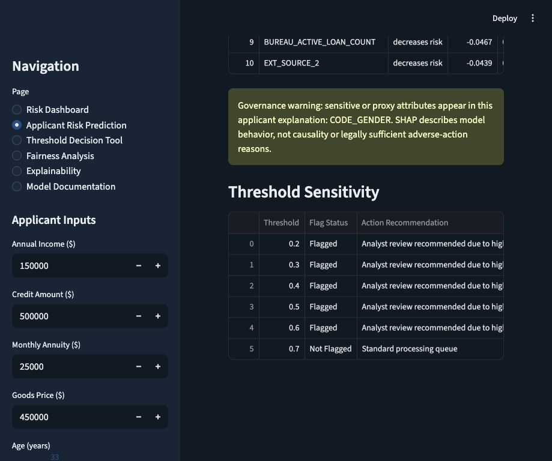
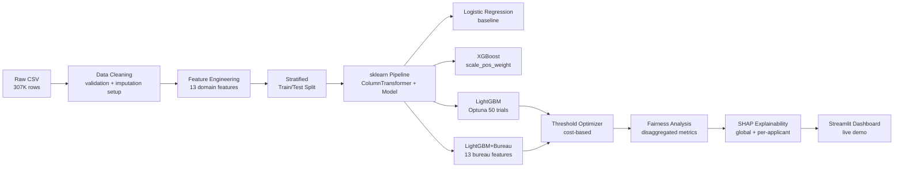

# Credit Risk Intelligence System
End-to-end credit risk ML system predicting loan payment difficulty on 307K+ applicants, with LightGBM+Bureau (AUC 0.77+), threshold optimization, fairness analysis, per-applicant SHAP explanations, and a live interactive Streamlit dashboard.

   

<a href="https://credit-risk-intelligence.streamlit.app"></a>



## Key Results

| Model | AUC-ROC | Avg Precision | Tuned CV AUC (5-fold) | Optimal Threshold |
|---|---:|---:|---:|---:|
| Logistic Regression | 0.7507 | 0.2333 | N/A | 0.65 |
| XGBoost | 0.7680 | 0.2575 | 0.7618 | 0.68 |
| LightGBM | 0.7715 | 0.2608 | 0.7655 | 0.66 |
| LightGBM+Bureau | 0.7746 | 0.2681 | 0.7702 | 0.66 |

*CV AUC for LightGBM and LightGBM+Bureau reflects 5-fold cross-validation on the Optuna-tuned hyperparameters, not the base configuration. XGBoost CV AUC reflects post-training cross-validation on the same stratified split.*

### Context

The Home Credit Default Risk Kaggle competition leaderboard shows single-table LightGBM approaches achieving ROC-AUC in the 0.78-0.80 range. This project achieves 0.77 on `application_train.csv` alone and 0.7746 with bureau feature integration. The remaining gap reflects the absence of the other relational tables (`previous_application`, `installments_payments`, `POS_CASH_balance`, `credit_card_balance`), which are acknowledged limitations. The project prioritises explainability, threshold decision framing, and fairness analysis over raw leaderboard score.

## Business Context

Credit risk screening is a threshold decision problem, not a classification accuracy problem. A model can rank applicants by risk, but the operating threshold determines how many applicants are routed to manual review and how many likely defaults are missed.

False negatives and false positives carry asymmetric operational costs. Missing a genuine future default can create credit losses, while false positives create manual-review burden, customer friction, and potential lost lending opportunities.

This system is designed as a review prioritization tool, not an automated decision engine. It supports analysts by surfacing risk scores, SHAP explanations, subgroup fairness metrics, and threshold tradeoffs while keeping final decisions in a governed human process.

## Technical Architecture



## Quickstart

```bash
git clone https://github.com/vergisodd/Credit-Risk-Intelligence-System.git
cd Credit-Risk-Intelligence-System
pip install -r requirements.txt
make pipeline
```

## Live Demo

> **[Open Live Dashboard →](https://credit-risk-intelligence.streamlit.app)**
> The dashboard displays pre-generated model comparison charts, fairness analysis,
> and explainability reports without requiring local model training.
> Applicant prediction and interactive threshold tools require local setup with
> trained model artifacts.

## Deploy Your Own Instance

1. Fork this repository
2. Sign in at [share.streamlit.io](https://share.streamlit.io)
3. Click "New app" → select your fork → set Main file path to `app/streamlit_app.py`
4. Deploy — the app runs on the pre-generated visuals and reports in the repository

## Feature Engineering

| Feature | Meaning |
|---|---|
| `CREDIT_INCOME_RATIO` | Credit amount relative to applicant income |
| `ANNUITY_INCOME_RATIO` | Loan annuity burden relative to income |
| `GOODS_CREDIT_RATIO` | Goods price relative to credit amount |
| `CREDIT_TERM_RATIO` | Annuity amount relative to credit amount |
| `INCOME_PER_FAMILY_MEMBER` | Income adjusted by family size |
| `AGE_YEARS` | Applicant age converted from days |
| `DAYS_EMPLOYED_CLEAN` | Employment days with anomalous values cleaned |
| `EMPLOYMENT_YEARS` | Employment length converted from days |
| `EXT_SOURCE_MEAN` | Average external source risk score |
| `EXT_SOURCE_MIN` | Minimum external source risk score |
| `EXT_SOURCE_MAX` | Maximum external source risk score |
| `EXT_SOURCE_PRODUCT` | Interaction between external source scores 1 and 2 |
| `CREDIT_TO_INCOME_TERM` | Credit amount relative to income and estimated term burden |
| **Bureau Features (bureau.csv)** | **Aggregated historical credit bureau signals** |
| `BUREAU_LOAN_COUNT` | Total number of previous bureau credit records |
| `BUREAU_ACTIVE_LOAN_COUNT` | Count of currently active bureau loans |
| `BUREAU_CLOSED_LOAN_COUNT` | Count of closed bureau loans |
| `BUREAU_AVG_DAYS_CREDIT` | Average age of prior bureau credit records |
| `BUREAU_AVG_DAYS_CREDIT_ENDDATE` | Average expected end date of bureau credit lines |
| `BUREAU_MAX_DAYS_OVERDUE` | Maximum days overdue across bureau records |
| `BUREAU_MEAN_DAYS_OVERDUE` | Average days overdue across bureau records |
| `BUREAU_SUM_AMT_CREDIT_SUM` | Total credit exposure recorded by bureau |
| `BUREAU_SUM_AMT_CREDIT_SUM_DEBT` | Total outstanding bureau debt |
| `BUREAU_SUM_AMT_CREDIT_SUM_OVERDUE` | Total overdue bureau amount |
| `BUREAU_ACTIVE_DEBT_RATIO` | Outstanding bureau debt relative to total bureau credit |
| `BUREAU_PROLONGED_LOAN_COUNT` | Count of bureau loans with prolonged repayment terms |
| `BUREAU_CREDIT_ACTIVE_RATIO` | Share of bureau loans that remain active |

## Fairness and Governance

`CODE_GENDER` is one of the strongest global SHAP drivers in the current LightGBM explanation run, ranking near the top alongside external credit-risk scores and repayment burden ratios. That makes it a governance priority rather than a casual feature choice.

The fairness analysis compares ROC-AUC, Average Precision, false positive rate, false negative rate, predicted default rate, and actual default rate by gender and education group. The M/F Equalized Odds gap is 0.2371, and removing `CODE_GENDER` reduced AUC by only 0.0017, so the feature should be further investigated before any regulated deployment. See [reports/fairness_report.md](reports/fairness_report.md).

Credit scoring is a high-governance domain. Any real deployment would require compliance review under ECOA in the United States, GDPR Article 22 in the European Union, the EU AI Act high-risk classification for credit scoring, and applicable national lending rules.

## Repository Structure

```text
Credit-Risk-Intelligence-System/
├── .streamlit/
│   └── config.toml
├── app/
│   └── streamlit_app.py
├── data/
│   ├── raw/
│   │   └── .gitkeep
│   └── processed/
│       └── .gitkeep
├── models/
│   └── .gitkeep
├── notebooks/
│   └── 01_eda_baseline.ipynb
├── reports/
│   ├── business_recommendations.md
│   ├── cost_threshold_analysis.csv
│   ├── explainability_report.md
│   ├── fairness_report.csv
│   ├── fairness_report.md
│   ├── lgbm_model_metrics.json
│   ├── lgbm_bureau_model_metrics.json
│   ├── lgbm_threshold_analysis.csv
│   ├── lgbm_bureau_threshold_analysis.csv
│   ├── model_card.md
│   ├── model_comparison.md
│   └── model_comparison_full.csv
├── screenshots/
│   ├── applicant_risk_prediction.png
│   ├── explainability.png
│   ├── model_comparison.png
│   ├── project_overview.png
│   └── threshold_analysis.png
├── src/
│   ├── config_loader.py
│   ├── data_cleaning.py
│   ├── evaluate_all.py
│   ├── explain_model.py
│   ├── fairness_analysis.py
│   ├── feature_engineering.py
│   ├── feature_engineering_bureau.py
│   ├── model_utils.py
│   ├── threshold_optimizer.py
│   ├── train_lightgbm.py
│   ├── train_lightgbm_bureau.py
│   ├── train_model.py
│   └── train_xgboost.py
├── tests/
│   ├── test_config_loader.py
│   ├── test_data_cleaning.py
│   ├── test_feature_engineering.py
│   ├── test_feature_engineering_bureau.py
│   └── test_threshold_optimizer.py
├── visuals/
│   ├── calibration_plot.png
│   ├── cost_threshold_analysis.png
│   ├── fairness_auc_education.png
│   ├── fairness_fpr_fnr_gender.png
│   ├── pr_comparison_all_models.png
│   ├── roc_comparison_all_models.png
│   └── shap_individual_high_risk.png
├── .gitignore
├── .python-version
├── config.yaml
├── Makefile
├── README.md
├── requirements-deploy.txt
└── requirements.txt
```

### Limitations

This project is a portfolio demonstration, not a production lending system.

**Data scope:** Only `application_train.csv` is used as the primary feature source. Bureau credit history is integrated via `src/feature_engineering_bureau.py` (13 aggregated features). The remaining four relational tables — `previous_application`, `installments_payments`, `POS_CASH_balance`, and `credit_card_balance` — are not yet integrated. Full integration is the primary path to closing the remaining gap against leaderboard AUC benchmarks.

**Modelling:** Precision for the default class remains low (approximately 0.17-0.18 at threshold 0.50), which is expected given an 8% base rate. At operating thresholds aligned to business cost scenarios (threshold 0.20-0.35), recall is high but precision remains low. This reflects the fundamental difficulty of the problem rather than a modelling failure.

**Explainability:** SHAP values describe model behavior, not causal credit risk factors. Individual applicant explanations show which features contributed most to a specific prediction — they do not constitute a regulatory explanation of an adverse action.

**Fairness:** The model exhibits a 0.24 Equalized Odds gap between male and female applicants at the lender-cost-optimal threshold. Removing `CODE_GENDER` reduces AUC by 0.0017. This tradeoff requires governance review before any regulated deployment. The fairness analysis in this project is diagnostic, not a mitigation.

**Deployment:** This system is not suitable for automated credit decisioning. It is designed for manual review queue prioritization only, with a human analyst making the final credit determination.

## Dataset

[Home Credit Default Risk](https://www.kaggle.com/competitions/home-credit-default-risk) via Kaggle. Used for educational and portfolio purposes only.

## License

MIT License. See [LICENSE](LICENSE).
