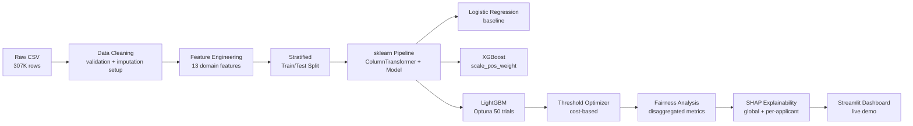

# Credit Risk Intelligence System
End-to-end credit risk ML system predicting loan payment difficulty on 307K+ applicants, with LightGBM (AUC 0.77+), threshold optimization, fairness analysis, per-applicant SHAP explanations, and a live interactive Streamlit dashboard.

   

<a href="[DEPLOY URL]"></a>


## Key Results

| Model | AUC-ROC | Avg Precision | CV AUC (5-fold) | Optimal Threshold |
|---|---:|---:|---:|---:|
| Logistic Regression | 0.7507 | 0.2333 | N/A | 0.65 |
| XGBoost | 0.7680 | 0.2575 | 0.7618 | 0.68 |
| LightGBM | 0.7715 | 0.2608 | 0.7491 | 0.66 |

## Business Context

Credit risk screening is a threshold decision problem, not a classification accuracy problem. A model can rank applicants by risk, but the operating threshold determines how many applicants are routed to manual review and how many likely defaults are missed.

False negatives and false positives carry asymmetric operational costs. Missing a genuine future default can create credit losses, while false positives create manual-review burden, customer friction, and potential lost lending opportunities.

This system is designed as a review prioritization tool, not an automated decision engine. It supports analysts by surfacing risk scores, SHAP explanations, subgroup fairness metrics, and threshold tradeoffs while keeping final decisions in a governed human process.

## Technical Architecture



## Quickstart

```bash
git clone https://github.com/vergisodd/Credit-Risk-Intelligence-System.git
cd Credit-Risk-Intelligence-System
pip install -r requirements.txt
make pipeline
```

## Feature Engineering

| Feature | Meaning |
|---|---|
| `CREDIT_INCOME_RATIO` | Credit amount relative to applicant income |
| `ANNUITY_INCOME_RATIO` | Loan annuity burden relative to income |
| `GOODS_CREDIT_RATIO` | Goods price relative to credit amount |
| `CREDIT_TERM_RATIO` | Annuity amount relative to credit amount |
| `INCOME_PER_FAMILY_MEMBER` | Income adjusted by family size |
| `AGE_YEARS` | Applicant age converted from days |
| `DAYS_EMPLOYED_CLEAN` | Employment days with anomalous values cleaned |
| `EMPLOYMENT_YEARS` | Employment length converted from days |
| `EXT_SOURCE_MEAN` | Average external source risk score |
| `EXT_SOURCE_MIN` | Minimum external source risk score |
| `EXT_SOURCE_MAX` | Maximum external source risk score |
| `EXT_SOURCE_PRODUCT` | Interaction between external source scores 1 and 2 |
| `CREDIT_TO_INCOME_TERM` | Credit amount relative to income and estimated term burden |

## Fairness and Governance

`CODE_GENDER` is one of the strongest global SHAP drivers in the current LightGBM explanation run, ranking near the top alongside external credit-risk scores and repayment burden ratios. That makes it a governance priority rather than a casual feature choice.

The fairness analysis compares ROC-AUC, Average Precision, false positive rate, false negative rate, predicted default rate, and actual default rate by gender and education group. The M/F Equalized Odds gap is 0.2371, and removing `CODE_GENDER` reduced AUC by only 0.0017, so the feature should be further investigated before any regulated deployment. See [reports/fairness_report.md](reports/fairness_report.md).

Credit scoring is a high-governance domain. Any real deployment would require compliance review under ECOA in the United States, GDPR Article 22 in the European Union, the EU AI Act high-risk classification for credit scoring, and applicable national lending rules.

## Repository Structure

```text
Credit-Risk-Intelligence-System/
├── .streamlit/
│   └── config.toml
├── app/
│   └── streamlit_app.py
├── data/
│   ├── raw/
│   │   └── .gitkeep
│   └── processed/
│       └── .gitkeep
├── models/
│   └── .gitkeep
├── notebooks/
│   └── 01_eda_baseline.ipynb
├── reports/
│   ├── business_recommendations.md
│   ├── cost_threshold_analysis.csv
│   ├── explainability_report.md
│   ├── fairness_report.csv
│   ├── fairness_report.md
│   ├── lgbm_model_metrics.json
│   ├── lgbm_threshold_analysis.csv
│   ├── model_card.md
│   ├── model_comparison.md
│   └── model_comparison_full.csv
├── screenshots/
│   ├── applicant_risk_prediction.png
│   ├── explainability.png
│   ├── model_comparison.png
│   ├── project_overview.png
│   └── threshold_analysis.png
├── src/
│   ├── config_loader.py
│   ├── data_cleaning.py
│   ├── evaluate_all.py
│   ├── explain_model.py
│   ├── fairness_analysis.py
│   ├── feature_engineering.py
│   ├── model_utils.py
│   ├── threshold_optimizer.py
│   ├── train_lightgbm.py
│   ├── train_model.py
│   └── train_xgboost.py
├── tests/
│   ├── test_config_loader.py
│   ├── test_data_cleaning.py
│   ├── test_feature_engineering.py
│   └── test_threshold_optimizer.py
├── visuals/
│   ├── calibration_plot.png
│   ├── cost_threshold_analysis.png
│   ├── fairness_auc_education.png
│   ├── fairness_fpr_fnr_gender.png
│   ├── pr_comparison_all_models.png
│   ├── roc_comparison_all_models.png
│   └── shap_individual_high_risk.png
├── .gitignore
├── .python-version
├── config.yaml
├── Makefile
├── README.md
└── requirements.txt
```

## Limitations

This is a serious portfolio project, but it is not a production lending system.

Current limitations:

- Only `application_train.csv` is used
- Other Home Credit relational tables are not yet integrated
- Bureau, previous application, installment, and credit card history data are not yet used
- Precision remains low for the default class
- SHAP values explain model behavior, not causal credit risk factors
- Sensitive attributes require governance review before deployment
- No deployed public app yet
- No drift monitoring yet
- Not suitable for automatic lending decisions

These limitations are important because real-world credit risk systems require stronger validation, monitoring, governance, fairness review, and human oversight.

## License

MIT License. See [LICENSE](LICENSE).
