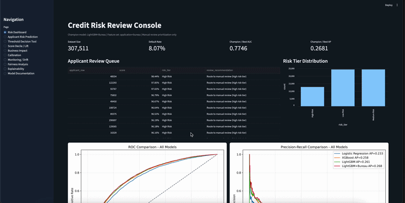
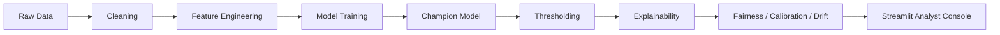

# Credit Risk Intelligence System

**End-to-end credit risk review-prioritization system using the Home Credit Default Risk dataset.**

This project builds a governed machine learning workflow that predicts applicant default risk, ranks applicants for manual review, explains model outputs with SHAP reason codes, and evaluates threshold, fairness, calibration, and drift risks.

It is designed as a **decision-support system for credit risk analysts**, not as an automated loan approval or rejection engine.


[Live Demo](https://credit-risk-intelligence-system.streamlit.app)

The hosted Streamlit app runs in **public demo mode** using committed reports, visuals, sample predictions, and reason codes.  
Full live scoring requires running the project locally with the Kaggle data and trained model artifacts.



---

## Project at a Glance

| Area | What This Project Demonstrates |
|---|---|
| Problem | Credit default risk review prioritization |
| Dataset | Home Credit Default Risk Kaggle dataset |
| Champion Model | LightGBM with application and bureau features |
| Best ROC-AUC | 0.7746 |
| Best Average Precision | 0.2681 against an 8.07% default base rate |
| Main Workflow | Data cleaning, feature engineering, model training, evaluation, thresholding, explainability, fairness, calibration, drift simulation, and dashboarding |
| Deployment | Streamlit analyst console with public demo mode |
| Engineering | Makefile, Docker, tests, CI, config-driven champion model registry |

---

## Champion Result

| Champion Model | Feature Set | ROC-AUC | Average Precision | Base Default Rate | Operating Threshold |
|---|---|---:|---:|---:|---:|
| LightGBM+Bureau | `application_train.csv` + `bureau.csv` aggregations | 0.7746 | 0.2681 | 8.07% | 0.66 F1-optimal |

The champion model improves ranking performance by combining applicant-level features with credit bureau aggregations.

Average Precision is evaluated against an 8.07% default base rate, which makes it more meaningful than accuracy for this imbalanced classification problem.

This project does **not** claim to automate lending decisions. The model is used to prioritize applicants for manual review and to support analyst decision-making.

---

## Why This Project Matters

Most student machine learning projects stop at model accuracy.

This project goes further by treating credit risk as an operational decision problem:

- Which applicants should be routed to manual review?
- What threshold should be used for review prioritization?
- How many defaults are captured at different review capacities?
- Which features are driving applicant-level risk predictions?
- Are sensitive or proxy attributes creating fairness concerns?
- Are model scores calibrated enough to support decision-making?
- What monitoring signals would matter before production use?

The goal is not only to build a predictive model, but to show how model outputs can be governed, explained, monitored, and translated into a practical risk-review workflow.

---

## What Makes This More Than a Generic ML Demo

This repository is structured as a credit-risk intelligence workflow, not just a notebook with a trained model.

Key upgrades include:

- A config-driven champion model registry in `config.yaml`
- A model manifest documenting artifact paths, feature set, metrics, threshold policy, scope, and limitations
- Separate workflows for training, evaluation, explainability, fairness, calibration, drift, score deciles, and business-impact simulation
- Explicit separation between default thresholds, F1-optimal thresholds, cost-minimizing thresholds, and risk-tier thresholds
- Applicant-level SHAP reason codes showing positive and negative risk contributors
- Fairness diagnostics across sensitive and proxy attributes
- Calibration analysis to test whether risk scores behave like reliable probability estimates
- Drift simulation using train-vs-holdout monitoring signals
- Streamlit analyst console for applicant review and risk triage
- Reproducible commands through Makefile, tests, Docker, Ruff/Black, and GitHub Actions CI

---

## Key Skills Demonstrated

- End-to-end machine learning pipeline design
- Credit risk classification using Logistic Regression, XGBoost, LightGBM, and LightGBM+Bureau
- Feature engineering from application and bureau-level credit data
- Optional relational feature engineering from previous applications, installments, POS cash, credit card, and bureau balance tables
- Imbalanced classification evaluation using ROC-AUC, Average Precision, recall, precision, F1, and lift
- Threshold optimization for manual review prioritization
- Score decile and cumulative default capture analysis
- Business-impact simulation using review-capacity and cost-unit assumptions
- SHAP explainability and applicant-level reason-code generation
- Fairness diagnostics across sensitive and proxy attributes
- Calibration and drift-monitoring reports
- Streamlit dashboard development for analyst workflows
- Reproducible project structure with Makefile, tests, Docker, Ruff/Black, and GitHub Actions CI

---

## System Workflow



---

## Analyst Console

The Streamlit app is designed as a credit risk analyst console.

The public deployment runs in demo mode because raw Kaggle files and trained model binaries are intentionally not committed. Demo mode shows the review workflow using committed outputs.

Local mode enables:

- Custom applicant input changes
- Live champion-model scoring
- Applicant-level SHAP explanations
- Reason-code tables
- Risk tier assignment
- Review queue prioritization
- Threshold and review-capacity tradeoff analysis
- Score decile and lift visualizations
- Business-impact simulation
- Calibration and drift report views
- Fairness and proxy-feature warnings

---

## Quick Reviewer Path

For reviewers who want to inspect the project quickly without downloading Kaggle data:

```bash
git clone https://github.com/vergisodd/Credit-Risk-Intelligence-System.git
cd Credit-Risk-Intelligence-System
pip install -r requirements.txt
make test
streamlit run app/streamlit_app.py
```

This opens the Streamlit app in demo mode using committed reports, visuals, sample predictions, and reason codes.

Full training and live champion-model scoring require the Kaggle files to be placed in `data/raw/`.

---

## Full Local Run

After placing the required Kaggle files in `data/raw/`, run:

```bash
pip install -r requirements.txt
make train-lgbm-bureau
make evaluate
make explain
make fairness
streamlit run app/streamlit_app.py
```

---

## Local Data Requirements

Raw Kaggle data and trained model artifacts are intentionally not committed.

Required for the full champion pipeline:

| Path | Required For |
|---|---|
| `data/raw/application_train.csv` | All training/evaluation workflows |
| `data/raw/bureau.csv` | Champion LightGBM+Bureau training, scoring, fairness, and explainability |

If `bureau.csv` is missing, the bureau champion workflow fails clearly instead of silently pretending an application-only model is the champion.

Optional for full-relational research training:

- `data/raw/previous_application.csv`
- `data/raw/installments_payments.csv`
- `data/raw/POS_CASH_balance.csv`
- `data/raw/credit_card_balance.csv`
- `data/raw/bureau_balance.csv`

The configured champion remains LightGBM+Bureau unless a deeper relational model is trained, reviewed, and deliberately promoted.

---

## Reproducible Commands

```bash
pip install -r requirements.txt
make test
make train-lgbm-bureau
make evaluate
make explain
make fairness
make score-deciles
make business-impact
make calibration
make drift
```

`make pipeline` runs installation, model training, evaluation, explainability, and fairness workflows. It requires the Kaggle files above and can take time because LightGBM tuning uses Optuna.

---

## Model Comparison

| Model | ROC-AUC | Average Precision | Tuned CV AUC |
|---|---:|---:|---:|
| Logistic Regression | 0.7507 | 0.2333 | N/A |
| XGBoost | 0.7680 | 0.2575 | 0.7618 |
| LightGBM | 0.7715 | 0.2608 | 0.7655 |
| **LightGBM+Bureau** | **0.7746** | **0.2681** | **0.7702** |

See [reports/model_comparison.md](reports/model_comparison.md) and [reports/model_card.md](reports/model_card.md).

---

## Threshold Policy

| Threshold | Meaning |
|---|---|
| Default threshold | Conventional 0.50 classifier cutoff |
| Cost-minimizing threshold | Minimizes a stated false-negative / false-positive cost scenario |
| F1-optimal threshold | Maximizes default-class F1; configured operating threshold for this portfolio workflow |
| Risk-tier thresholds | Score bands for analyst triage, not binary decision rules |

Fairness reports do not label the F1-optimal threshold as “lender-cost-optimal.”

---

## Score Decile and Lift Analysis

AUC is not enough for credit review. A useful review-prioritization model should concentrate observed defaults in the highest-risk score bands.

`make score-deciles` generates:

- `reports/score_decile_analysis.csv`
- `reports/score_decile_analysis.md`
- `visuals/score_decile_lift.png`
- `visuals/cumulative_default_capture.png`

The report validates whether top-risk bands have default rates above the 8.07% base rate without hard-coding results into the README.

---

## Business Impact Simulation

The model is evaluated as a review-routing policy, not as an automated decision engine.

`make business-impact` compares default, F1-optimal, cost-minimizing, and top-capacity review policies across:

- Recall
- Precision
- F1
- False reviews
- Missed defaults
- Relative cost units

These are cost units for portfolio demonstration, not dollars or claimed financial savings. The goal is to connect model scores to a decision-support workflow.

---

## Calibration

`make calibration` reports:

- Brier score
- Mean predicted risk
- Calibration by score decile
- Calibration by risk tier

Scores are useful for ranking applicants, but they should not be treated as perfectly calibrated probability-of-default estimates without additional validation.

---

## Monitoring and Drift Simulation

`make drift` runs a lightweight train-vs-holdout monitoring simulation using:

- Population Stability Index
- Missing-rate deltas
- Summary-statistic shifts

This is a simulation of monitoring expectations, not live production monitoring.

---

## Docker Demo

```bash
docker build -t credit-risk-intelligence .
docker run -p 8501:8501 credit-risk-intelligence
```

Docker runs the demo-mode Streamlit app unless local Kaggle data and trained model artifacts are mounted into the container.

---

## Governance Notes

`CODE_GENDER`, `NAME_EDUCATION_TYPE`, and `ORGANIZATION_TYPE` are retained for transparent portfolio diagnostics.

A regulated lender would need legal, compliance, and model-risk review before using sensitive or proxy attributes. Removing protected attributes does not eliminate proxy bias.

SHAP values describe model behavior, not causality, and are not legally sufficient adverse-action reasons.

Validation details are documented in [reports/validation_strategy.md](reports/validation_strategy.md).

---

## Repository Structure

```text
Credit-Risk-Intelligence-System/
│
├── README.md                         Project overview, results, demo, and usage guide
├── LICENSE                           MIT license
├── Makefile                          Reproducible commands for training, testing, reports, and app launch
├── requirements.txt                  Python dependencies
├── pyproject.toml                    Ruff, Black, and pytest configuration
├── config.yaml                       Central paths, artifact names, thresholds, and model settings
├── Dockerfile                        Demo-mode Streamlit container
├── .dockerignore                     Docker build exclusions
├── .gitignore                        Git exclusions for data, models, cache files, and local artifacts
├── .python-version                   Python version pin
│
├── .github/
│   └── workflows/
│       └── ci.yml                    GitHub Actions CI workflow
│
├── .devcontainer/                    Optional VS Code / GitHub Codespaces development container
│
├── .streamlit/                       Streamlit deployment/config files
│
├── app/
│   └── streamlit_app.py              Streamlit analyst console for demo and local interactive mode
│
├── src/
│   ├── config_loader.py              Config loading and path resolution
│   ├── data_cleaning.py              Application data loading, cleaning, and schema checks
│   ├── feature_engineering.py        Application-level feature engineering
│   ├── feature_engineering_bureau.py Bureau aggregation features
│   ├── feature_engineering_relational.py Optional relational-table feature engineering
│   ├── model_utils.py                Shared preprocessing, training, evaluation, plotting, and artifact helpers
│   ├── champion_model.py             Champion model registry and manifest helpers
│   ├── threshold_optimizer.py        Threshold optimization and policy logic
│   ├── train_model.py                Logistic regression baseline training
│   ├── train_xgboost.py              XGBoost training workflow
│   ├── train_lightgbm.py             Application-only LightGBM training workflow
│   ├── train_lightgbm_bureau.py      Champion LightGBM+Bureau training workflow
│   ├── train_lightgbm_full_relational.py Optional full-relational research workflow
│   ├── evaluate_all.py               Model comparison, calibration, and threshold reporting
│   ├── score_decile_analysis.py      Score decile and lift analysis
│   ├── business_impact_simulation.py Review-routing policy simulation
│   ├── calibration_report.py         Calibration diagnostics
│   ├── drift_monitoring.py           Train-vs-holdout drift simulation
│   ├── explain_model.py              SHAP explainability and reason-code generation
│   └── fairness_analysis.py          Fairness and subgroup diagnostic reporting
│
├── tests/                            Unit tests for thresholds, features, fairness, champion logic, and reports
│
├── data/
│   ├── raw/                          Local-only Kaggle raw data placeholder
│   └── processed/                    Local-only processed data placeholder
│
├── models/                           Local-only trained model artifact placeholder
│
├── reports/                          Generated model cards, manifests, metrics, diagnostics, and business reports
│
├── visuals/                          Generated charts for model performance, SHAP, fairness, calibration, drift, and business analysis
│
├── screenshots/                      App screenshots used in README/demo
│
└── notebooks/                        Exploratory notebooks with outputs stripped to reduce repo weight
```

---

## Limitations

This is an applied machine learning portfolio project, not a production lending system.

Current limitations include:

- No true temporal validation across real lending periods
- No live production monitoring or automated model retraining
- No formal adverse-action notice generation
- No legal or compliance review
- No real lender cost data
- No external validation on another credit-risk dataset
- No production-grade model risk management process

The configured champion model uses application and bureau features. Deeper relational training is available as an optional research workflow and must be rerun locally with the full Kaggle dataset.

Model scores should only be interpreted as review-prioritization signals for this demonstration, not as final lending decisions.

---

## What I Learned

This project reinforced that credit-risk machine learning is not just about maximizing ROC-AUC.

A useful risk model also needs:

- Clear threshold policy
- Strong performance on imbalanced data
- Explainable applicant-level outputs
- Fairness and proxy-feature diagnostics
- Calibration checks
- Monitoring assumptions
- Business translation into manual review workflows

The biggest lesson was that a model is only useful if its outputs can be trusted, explained, governed, and used inside a realistic decision process.

---

## Dataset

[Home Credit Default Risk](https://www.kaggle.com/competitions/home-credit-default-risk), used for educational and portfolio purposes.

---

## License

MIT License. See [LICENSE](LICENSE).
