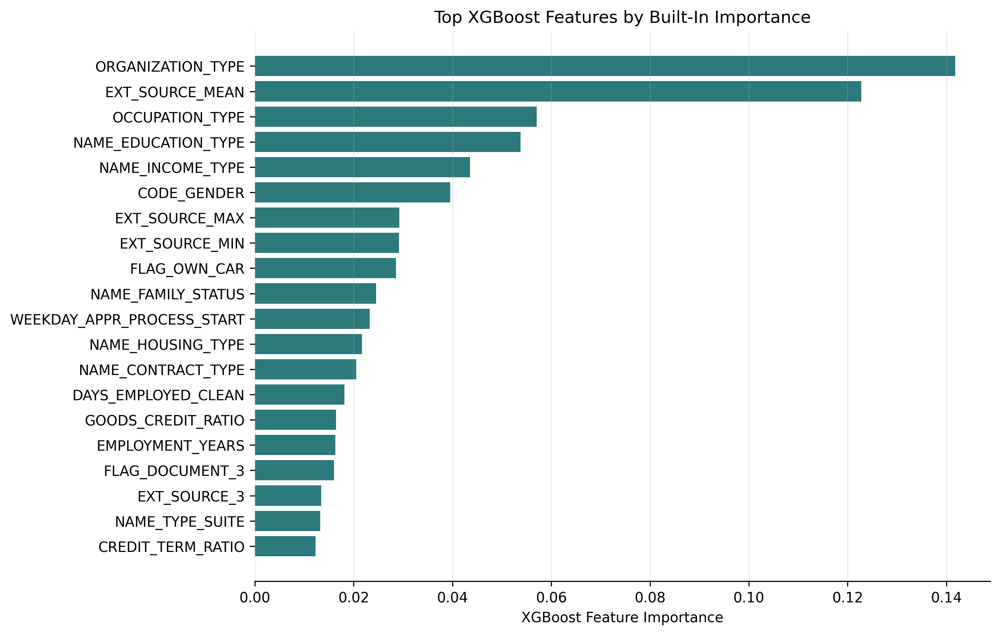
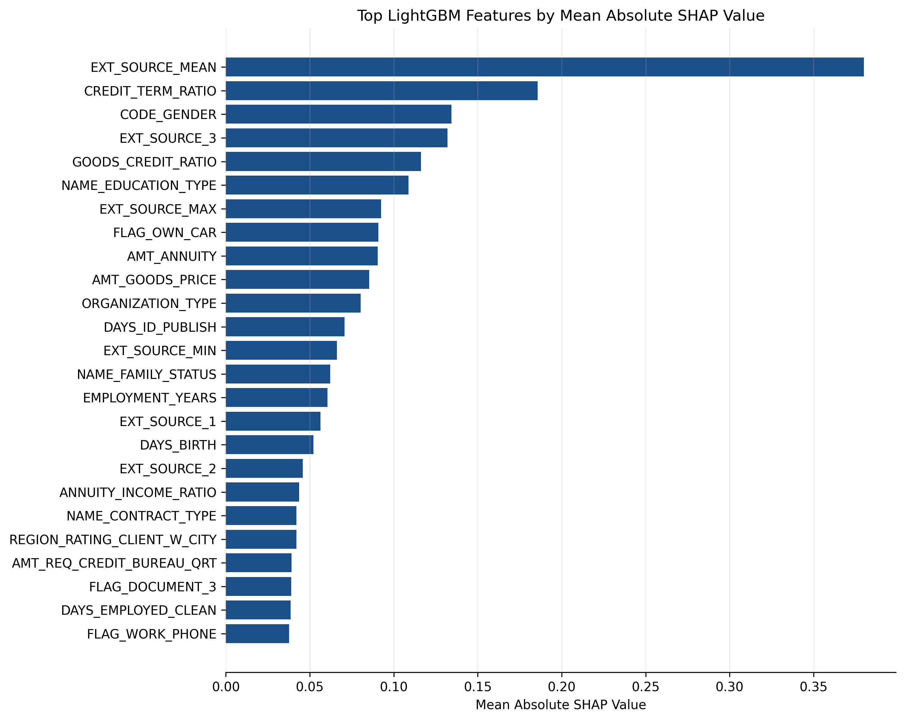
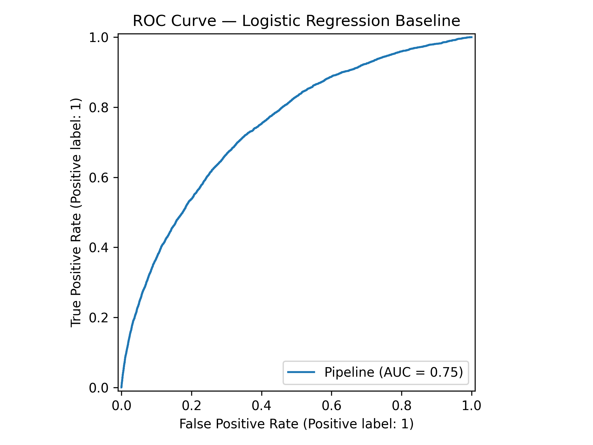
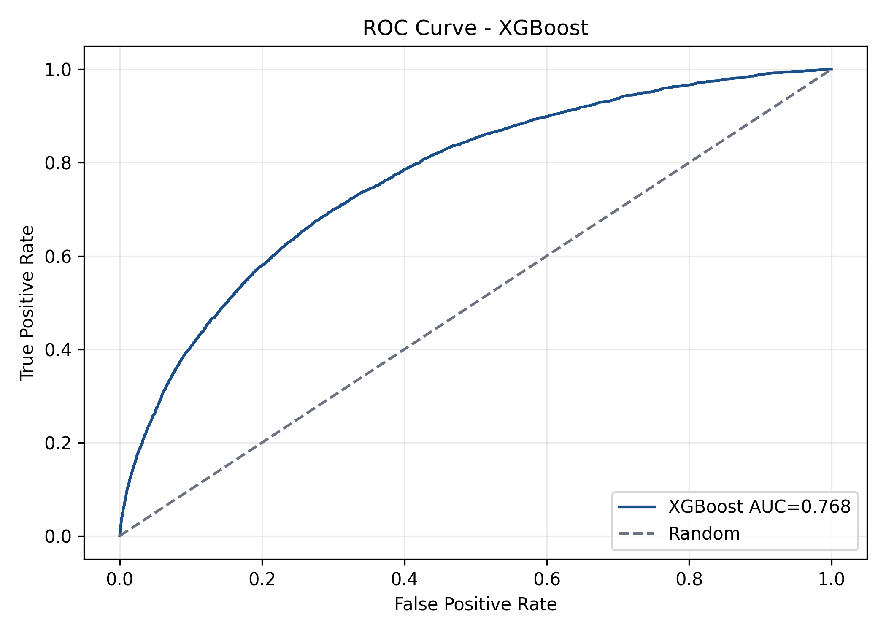
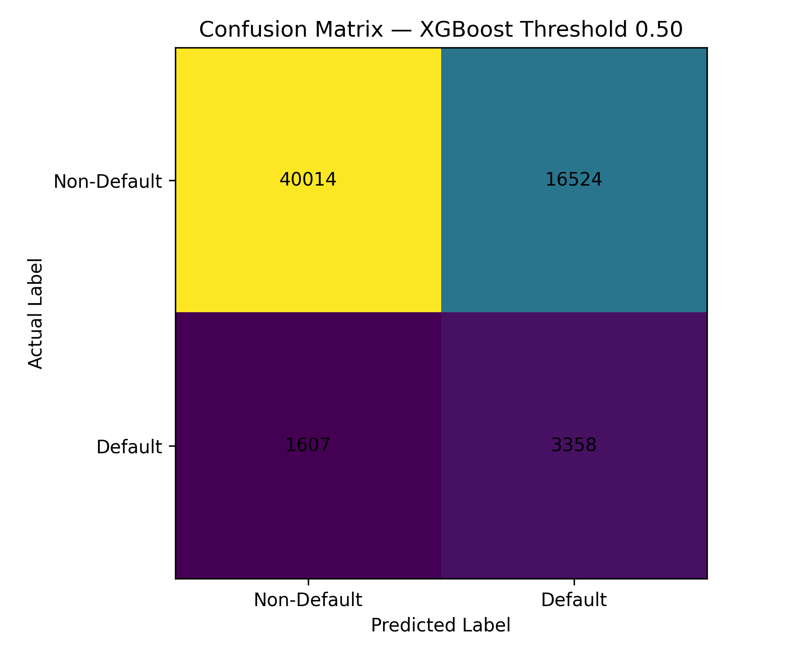

# Credit Risk Intelligence System

End-to-end machine learning pipeline for predicting loan applicant payment difficulty using the Home Credit Default Risk dataset.

This project cleans applicant data, engineers credit-risk features, trains Logistic Regression and XGBoost models, compares performance, analyzes classification thresholds, assigns business risk tiers, adds model explainability, and provides a Streamlit dashboard for applicant-level credit risk review.

---

## Project Overview

The Credit Risk Intelligence System is a data science portfolio project focused on credit risk screening and manual review prioritization.

Using the Home Credit Default Risk dataset, the project predicts whether a loan applicant is likely to experience payment difficulty. Model probabilities are translated into practical risk tiers so that applicants can be reviewed in a business-friendly way.

The project includes:

- Reproducible Python machine learning scripts
- Data cleaning and missing-value handling
- Domain-informed feature engineering
- Logistic Regression baseline model
- XGBoost comparison model
- Model evaluation for an imbalanced classification problem
- Threshold analysis for business tradeoff interpretation
- Risk tier assignment logic
- XGBoost feature importance and SHAP explainability workflow
- Applicant-level prediction script
- Streamlit dashboard for model review and risk exploration
- Model card, model comparison report, and business recommendations

---

## Business Problem

Credit risk modelling is not only a prediction problem. It is a decision-support problem with real business tradeoffs.

Lenders need to identify applicants who may be at higher risk of payment difficulty while avoiding unnecessary friction for reliable applicants.

Two errors matter:

1. **False negatives**: risky applicants are predicted as lower risk and may later experience payment difficulty.
2. **False positives**: reliable applicants are incorrectly flagged as risky, creating unnecessary manual review or potential lost lending opportunities.

Because payment difficulty cases are relatively rare, accuracy alone is not enough. A model can appear accurate by mostly predicting the majority class. This project evaluates models using ROC-AUC, precision, recall, F1-score, confusion matrices, and threshold analysis.

This system is framed as a risk-screening and manual-review prioritization tool, not an automatic loan rejection system.

---

## Dataset

This project uses the [Home Credit Default Risk dataset](https://www.kaggle.com/competitions/home-credit-default-risk/data) from Kaggle.

The current version uses only:

```text
application_train.csv
```

Target variable:

```text
TARGET = 1 -> applicant had payment difficulty
TARGET = 0 -> applicant did not have payment difficulty
```

The raw dataset is not committed to this repository because of file size and licensing considerations.

### Dataset Summary

| Item | Value |
|---|---:|
| Rows | 307,511 |
| Raw Columns | 122 |
| Final Model Features | 82 |
| Dropped Columns | 50 |
| Engineered Features | 11 |
| Default / Payment Difficulty Rate | 8.07% |
| Non-Default Rate | 91.93% |

This is an imbalanced binary classification problem.

---

## Project Workflow

```text
Raw Data
   -> Data Cleaning
   -> Feature Engineering
   -> Train/Test Split
   -> Preprocessing
   -> Logistic Regression
   -> XGBoost
   -> Evaluation
   -> Threshold Analysis
   -> Explainability
   -> Risk Tiers
   -> Streamlit App
```

---

## Tools and Technologies

- Python
- pandas
- NumPy
- scikit-learn
- XGBoost
- SHAP
- Streamlit
- matplotlib
- seaborn
- joblib
- Git/GitHub

---

## Feature Engineering

The project adds domain-informed credit risk features designed to capture applicant affordability, credit burden, employment history, and external risk signals.

| Feature | Meaning |
|---|---|
| `CREDIT_INCOME_RATIO` | Credit amount relative to applicant income |
| `ANNUITY_INCOME_RATIO` | Loan annuity burden relative to income |
| `GOODS_CREDIT_RATIO` | Goods price relative to credit amount |
| `CREDIT_TERM_RATIO` | Annuity amount relative to credit amount |
| `INCOME_PER_FAMILY_MEMBER` | Income adjusted by family size |
| `AGE_YEARS` | Applicant age converted from days |
| `DAYS_EMPLOYED_CLEAN` | Employment days with anomalous values cleaned |
| `EMPLOYMENT_YEARS` | Employment length converted from days |
| `EXT_SOURCE_MEAN` | Average external source risk score |
| `EXT_SOURCE_MIN` | Minimum external source risk score |
| `EXT_SOURCE_MAX` | Maximum external source risk score |

---

## Models Trained

| Model | Role | Imbalance Handling |
|---|---|---|
| Logistic Regression | Baseline linear classifier | `class_weight="balanced"` |
| XGBoost | Gradient boosting comparison model | `scale_pos_weight` |

The Logistic Regression model provides a transparent baseline. XGBoost is used as a stronger nonlinear model to test whether gradient boosting improves risk ranking.

---

## Logistic Regression Results

Performance on the test set at threshold `0.50`:

| Metric | Value |
|---|---:|
| Accuracy | 0.6900 |
| ROC-AUC | 0.7470 |
| Precision - Default Class | 0.1612 |
| Recall - Default Class | 0.6755 |
| F1 - Default Class | 0.2602 |

The Logistic Regression baseline achieves useful ranking ability, but precision for the default class is low.

---

## XGBoost Results

Performance on the test set at threshold `0.50`:

| Metric | Value |
|---|---:|
| Accuracy | 0.7052 |
| ROC-AUC | 0.7613 |
| Precision - Default Class | 0.1689 |
| Recall - Default Class | 0.6763 |
| F1 - Default Class | 0.2703 |

XGBoost improves performance across the main metrics, but the improvement over Logistic Regression is modest.

---

## Model Comparison

| Metric | Logistic Regression | XGBoost | Better Model |
|---|---:|---:|---|
| Accuracy | 0.6900 | 0.7052 | XGBoost |
| ROC-AUC | 0.7470 | 0.7613 | XGBoost |
| Precision - Default Class | 0.1612 | 0.1689 | XGBoost |
| Recall - Default Class | 0.6755 | 0.6763 | XGBoost |
| F1 - Default Class | 0.2602 | 0.2703 | XGBoost |

XGBoost is currently the strongest model in the project. It improves ROC-AUC from `0.7470` to `0.7613` and reduces false positives by `934` applicants at threshold `0.50`, while keeping recall almost unchanged.

The result is meaningful, but not dramatic. Precision remains low, so the model is better suited for risk screening and manual review prioritization than automatic decision-making.

---

## Confusion Matrix Comparison

### Logistic Regression - Threshold 0.50

| Actual / Predicted | Predicted Non-Default | Predicted Default |
|---|---:|---:|
| Actual Non-Default | 39,080 | 17,458 |
| Actual Default | 1,611 | 3,354 |

### XGBoost - Threshold 0.50

| Actual / Predicted | Predicted Non-Default | Predicted Default |
|---|---:|---:|
| Actual Non-Default | 40,014 | 16,524 |
| Actual Default | 1,607 | 3,358 |

At the default `0.50` threshold, XGBoost reduces false positives while maintaining nearly the same ability to catch payment difficulty cases.

---

## Threshold Analysis

Classification thresholds matter because they control the business tradeoff between catching more risky applicants and reducing unnecessary manual review.

A lower threshold flags more applicants as risky. This increases recall but creates more false positives.

A higher threshold is more selective. This improves precision but misses more applicants who later experience payment difficulty.

### Logistic Regression Threshold Summary

| Threshold | Recall | Precision | Business Meaning |
|---:|---:|---:|---|
| 0.20 | 0.9720 | 0.0908 | Very aggressive screening |
| 0.50 | 0.6755 | 0.1612 | Broad baseline screening |
| 0.70 | 0.3430 | 0.2554 | Stricter manual review queue |
| 0.80 | 0.1716 | 0.3403 | Conservative high-risk flag |

### XGBoost Threshold Summary

| Threshold | Recall | Precision | Business Meaning |
|---:|---:|---:|---|
| 0.20 | 0.9696 | 0.0931 | Very aggressive screening |
| 0.50 | 0.6763 | 0.1689 | Broad baseline screening |
| 0.70 | 0.3553 | 0.2709 | Stricter manual review queue |
| 0.80 | 0.1627 | 0.3732 | Conservative high-risk flag |

Threshold analysis makes the project more realistic because credit risk models are rarely judged by one default cutoff alone.

---

## Risk Tier Logic

Predicted probabilities are translated into business risk tiers for easier interpretation.

| Risk Tier | Default Probability | Suggested Action |
|---|---:|---|
| Low Risk | `< 0.30` | Standard processing |
| Medium Risk | `0.30 - 0.59` | Additional review if loan amount is high |
| High Risk | `>= 0.60` | Manual risk review recommended |

These tiers are designed for review prioritization, not automatic approval or rejection.

---

## Explainability

The project includes an XGBoost explainability workflow that generates global feature importance outputs from the trained model.

This layer helps answer a practical review question: which feature groups most influenced the model's risk ranking behavior across sampled holdout applicants?

The explainability script:

- Loads the trained XGBoost sklearn Pipeline
- Reuses the existing data cleaning and feature engineering functions
- Applies the fitted preprocessing pipeline from the trained model
- Samples holdout rows so SHAP remains practical on a local machine
- Groups one-hot encoded categorical features back to their original feature names
- Saves explanation outputs to `reports/` and `visuals/`

Run locally after training XGBoost:

```bash
python src/explain_model.py --sample-size 500 --top-n 20
```

Generated outputs include:

| Output | Purpose |
|---|---|
| `reports/shap_feature_importance.csv` | Global SHAP feature importance ranked by mean absolute SHAP value |
| `reports/xgboost_feature_importance.csv` | Built-in XGBoost feature importance |
| `reports/explainability_report.md` | Plain-English explainability summary and limitations |
| `visuals/shap_feature_importance_xgboost.png` | SHAP global feature importance chart |
| `visuals/xgboost_feature_importance.png` | Built-in XGBoost feature importance chart |

Built-in XGBoost importance provides a fast view of which features the model uses heavily. SHAP importance estimates the average contribution size of each feature to predictions across sampled holdout rows.

Feature importance is useful for model transparency, but it is not causal evidence and should not be used as the sole basis for lending decisions.

### Explainability Visuals





### Top Model Drivers

The global SHAP analysis identified the following strongest risk drivers in the XGBoost model:

| Rank | Feature | Interpretation |
|---:|---|---|
| 1 | `EXT_SOURCE_MEAN` | Aggregated external credit-risk signal |
| 2 | `CODE_GENDER` | Demographic feature requiring careful fairness review |
| 3 | `CREDIT_TERM_RATIO` | Loan annuity relative to total credit amount |
| 4 | `GOODS_CREDIT_RATIO` | Goods price relative to credit amount |
| 5 | `NAME_EDUCATION_TYPE` | Applicant education category |

These features help explain broad model behavior, but they are not causal proof. Sensitive or demographic-related features require careful governance before any real-world lending use.

---

## Streamlit App

The project includes an interactive Streamlit dashboard for exploring model outputs and credit risk decisions.

The dashboard supports:

- Project overview
- Applicant-level risk prediction
- Model selection
- Logistic Regression vs XGBoost comparison
- ROC curve viewing
- Confusion matrix viewing
- Threshold analysis
- Risk tier interpretation
- Historical outcome review for selected applicants
- Explainability output review when generated locally

Run locally:

```bash
streamlit run app/streamlit_app.py
```

---

## Visual Examples

### ROC Curves





### Confusion Matrices




---

## Repository Structure

Some report and visual files are generated locally after running the training and explainability scripts.

```text
Credit-Risk-Intelligence-System/
├── app/
│   └── streamlit_app.py
├── data/
│   ├── raw/
│   │   └── .gitkeep
│   └── processed/
│       └── .gitkeep
├── models/
│   └── .gitkeep
├── notebooks/
│   └── 01_eda_baseline.ipynb
├── reports/
│   ├── baseline_model_metrics.json
│   ├── business_recommendations.md
│   ├── explainability_report.md
│   ├── logistic_regression_evaluation.json
│   ├── model_card.md
│   ├── model_comparison.md
│   ├── sample_predictions.csv
│   ├── shap_feature_importance.csv
│   ├── threshold_analysis.csv
│   ├── xgboost_feature_importance.csv
│   ├── xgboost_model_metrics.json
│   └── xgboost_threshold_analysis.csv
├── src/
│   ├── data_cleaning.py
│   ├── evaluate_model.py
│   ├── explain_model.py
│   ├── feature_engineering.py
│   ├── predict.py
│   ├── train_model.py
│   └── train_xgboost.py
├── visuals/
│   ├── confusion_matrix_threshold_0_50.png
│   ├── confusion_matrix_xgboost_threshold_0_50.png
│   ├── roc_curve_logistic_regression.png
│   ├── roc_curve_xgboost.png
│   ├── shap_feature_importance_xgboost.png
│   └── xgboost_feature_importance.png
├── .gitignore
├── README.md
└── requirements.txt
```

The repository intentionally excludes raw data files and trained model artifacts.

---

## How to Run Locally

### 1. Clone the repository

```bash
git clone https://github.com/vergisodd/Credit-Risk-Intelligence-System.git
cd Credit-Risk-Intelligence-System
```

### 2. Create a virtual environment

For macOS/Linux:

```bash
python3 -m venv venv
source venv/bin/activate
```

For Windows:

```bash
python -m venv venv
venv\Scripts\activate
```

### 3. Install dependencies

```bash
pip install -r requirements.txt
```

### 4. Download the dataset

Download the Home Credit Default Risk dataset manually from Kaggle:

```text
https://www.kaggle.com/competitions/home-credit-default-risk/data
```

Place the following file:

```text
application_train.csv
```

inside:

```text
data/raw/
```

Expected local path:

```text
data/raw/application_train.csv
```

### 5. Train the Logistic Regression baseline

```bash
python src/train_model.py
```

### 6. Train the XGBoost model

```bash
python src/train_xgboost.py
```

### 7. Generate XGBoost explainability outputs

```bash
python src/explain_model.py --sample-size 500 --top-n 20
```

### 8. Evaluate Logistic Regression

```bash
python src/evaluate_model.py
```

### 9. Generate sample predictions

```bash
python src/predict.py
```

### 10. Run the Streamlit app

```bash
streamlit run app/streamlit_app.py
```

---

## Key Project Files

| File | Purpose |
|---|---|
| `src/data_cleaning.py` | Loads raw data, handles missing values, drops high-missing columns, and prepares features and target |
| `src/feature_engineering.py` | Creates domain-informed credit risk features |
| `src/train_model.py` | Trains the Logistic Regression baseline model |
| `src/train_xgboost.py` | Trains the XGBoost model and saves XGBoost metrics/visuals |
| `src/evaluate_model.py` | Evaluates the Logistic Regression model and saves threshold analysis |
| `src/explain_model.py` | Generates SHAP and XGBoost feature importance outputs |
| `src/predict.py` | Generates applicant-level default probabilities and risk tiers |
| `app/streamlit_app.py` | Interactive Streamlit dashboard for risk prediction, model comparison, threshold analysis, and explainability review |
| `reports/model_card.md` | Model documentation, intended use, and limitations |
| `reports/model_comparison.md` | Comparison of Logistic Regression and XGBoost performance |
| `reports/explainability_report.md` | Summary of global XGBoost/SHAP feature importance and interpretation limits |
| `reports/business_recommendations.md` | Business interpretation and recommended use cases |

---

## Current Limitations

This is a serious portfolio project, but it is not a production lending system.

Current limitations:

- Only `application_train.csv` is used
- Other Home Credit relational tables are not yet integrated
- Bureau, previous application, installment, and credit card history data are not yet used
- Precision remains low for the default class
- Explainability is currently global rather than applicant-level inside the app
- SHAP uses a sampled holdout set for practical runtime
- No full fairness or bias analysis yet
- No deployed public app yet
- No drift monitoring yet
- Not suitable for automatic lending decisions

These limitations are important because real-world credit risk systems require stronger validation, monitoring, governance, fairness review, and human oversight.

---

## Next Improvements

Planned improvements:

- Add applicant-level SHAP explanations in the Streamlit app
- Add Random Forest comparison model
- Add cost-based threshold optimization
- Integrate additional Home Credit relational tables
- Add fairness and bias analysis with careful interpretation
- Deploy the Streamlit app publicly
- Add screenshots of the Streamlit dashboard
- Add model monitoring and drift simulation
- Add tests for core data cleaning and feature engineering functions

---

## Business Takeaway

The models are not strong enough for automatic lending decisions, but they are useful as risk-screening tools that help prioritize manual review.

XGBoost is currently the strongest model, but the improvement over Logistic Regression is modest. The project demonstrates realistic credit risk modelling, threshold tradeoffs, business interpretation, model explainability, and end-to-end machine learning workflow design.

This project is best understood as a decision-support system for identifying applicants who may require closer review, not as an automated credit approval or rejection engine.
